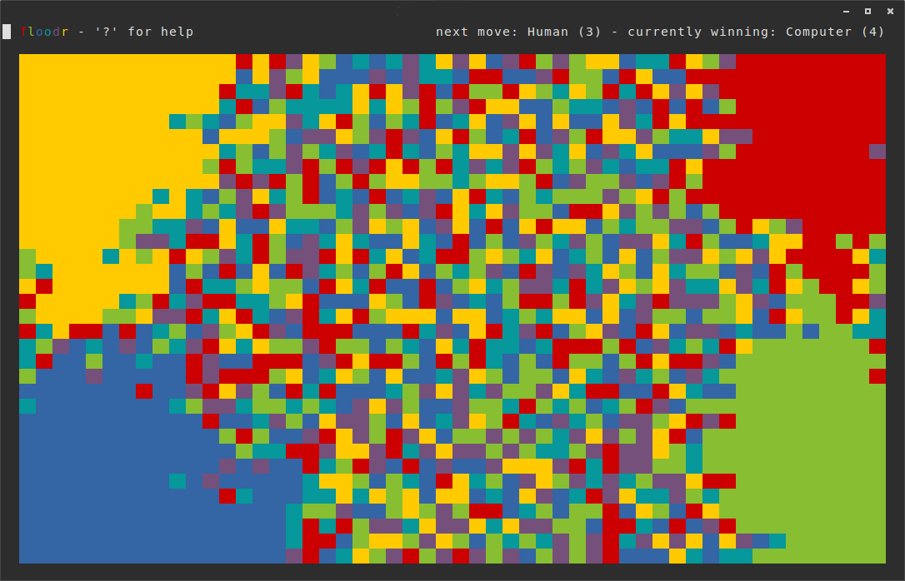

# floodr

floodr is a game for the unix terminal. The goal is to make your part
of the board as large as possible. It is possible to play alone or
with up to four players, and there is also an AI.

This was mostly a project for myself to learn some clojure, but now
it's out there for anyone who is interested!

## Installation

Download the standalone jar from http://example.com/FIXME.

Or clone the repo and use [leiningen](http://leiningen.org/) to run it.

## Usage

    $ java -jar floodr-0.2.0-standalone.jar [args]

However I recommend to create an alias in `~/.bash_aliases`

    alias floodr='java -jar /path/to/floodr-0.2.0-standalone.jar'

## Options

`--swing` if you want to use a GUI terminal. This should only be used
if you don't have `/bin/sh`.

## License

Copyright © 2015

Distributed under the Eclipse Public License version 1.0, the same as clojure.
