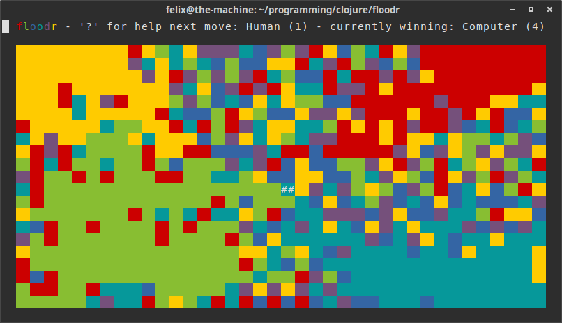
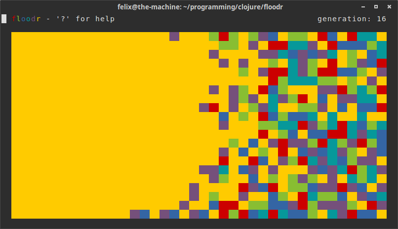
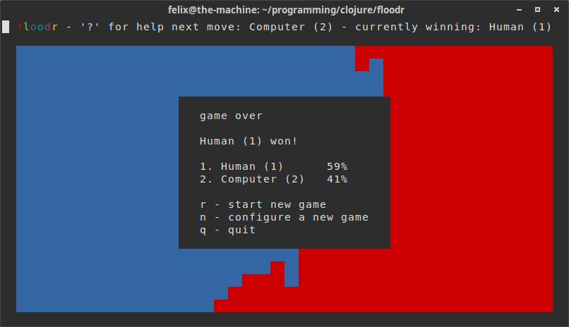
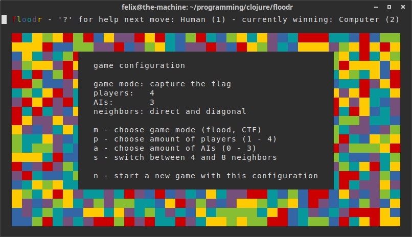

# floodr

A game for the unix terminal.

    

floodr is a game about coloring blocks to either get the biggest part
of the blocks or capture a specific block. Take a look a the
screenshots for more information or simply download the jar and try it
yourself!

This was mostly a project for myself to learn some clojure, but now
it's out there for anyone who is interested!

## Installation

Download the standalone jar from the
[releases page](https://github.com/greenkeeper/floodr/releases/tag/v0.3). 

Or clone the repo and use [leiningen](http://leiningen.org/) to run it.

## Starting

    $ java -jar floodr-0.3-standalone.jar [args]

However I recommend to create an alias in `~/.bash_aliases`

    alias floodr='java -jar /path/to/floodr-0.3-standalone.jar'

Add `--swing` as an argument if you want to use a GUI terminal. This
should only be used if you don't have `/bin/sh`, because it is not
very pretty.

## Controls

Type `?` to get an overview of the controls.

`s` `d` `f` and `j` `k` `l` are used to colorize your block.

`n` to configure and start a new game and `q` to quit.

## Screenshots

    
    capture the flag with 4 players  
    
      
    
    single player flood  

      
    
    win screen  

      
    
    game configuration  
    
      

## License

Copyright © 2015

Distributed under the Eclipse Public License version 1.0, the same as clojure.
